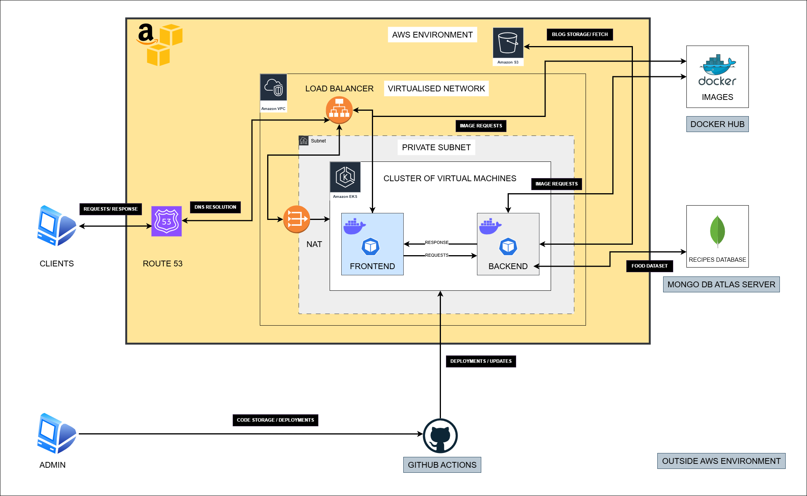

# CookSmart 

These are the terraform files for the **CookSmart** application that i developed.

## Description

**CookSmart** is an application that allows users to input body metrics, diet preferences and other information 
to receive an analysis dashboard as well as a custom diet plan. The app is completely serverless and runs
using various services such as EKS, S3, Route 53, VPC etc. An overall architecture diagram of the project
is given below. (Note: The S3 bucket storing blog data is not part of the terraform configuration currently 
due to some data being added externally through an admin panel and not automatically)




## Getting Started

### Dependencies/Requirements

* Have terraform installed
* Have the AWS CLI, Helm, Kubernetes installed
* Be logged in using 'aws config' with a user having required permissions
* Make sure the "terraform_user"
* Create a secrets file called secrets.tfvars with the following:
    * aws_access_key = "<your aws access key here>"
    * aws_secret_key = "<your secret access key here>"
    * root_arn = "arn:aws:iam::yourawsaccountid:root"
    * terraform_user_id = "<user id of the IAM user creating infra using terraform>"
    * terraform_user_arn = "arn:aws:iam::yourawsaccountid:user/terraform_user"


## Steps to Set-Up the Application

* [Creating the Infrastructure](#creating-the-infrastructure)
* [Set up the Database](#set-up-the-database)
* [Create the S3 Bucket](#create-the-s3-bucket)
* [Deploying the Application](#deploying-the-application)


### Creating the Infrastructure

```
terraform init
terraform plan -var-file="secrets.tfvars"
terraform apply -var-file="secrets.tfvars"

```

### Set up the Database

Create a cluster on MongoDB Atlas [here](https://account.mongodb.com) and load the processed dataset.
Additionally, please note the connection string like the one below. It will be needed in setting up variables
for the backend to connect to.

```
mongodb+srv://shaivamuthaiya:<db_password>@cluster0.xbiritm.mongodb.net/

```

### Create the S3 Bucket

Go to the AWS Console or use the CLI to create a S3 Bucket with two folders **blogs** and **images**. These
folders will store the content that will be rendered in the frontend in the blogs section. Please configure the 
access policies as well as CORS so that the application can read from the bucket and allow the admin to upload blogs. 
Also note the bucket arn and url as they will be useful in setting up variables later.

The bucket policy is given below in JSON format.

```
{
    "Version": "2012-10-17",
    "Statement": [
        {
            "Sid": "PublicReadGetObject",
            "Effect": "Allow",
            "Principal": "*",
            "Action": "s3:*",
            "Resource": "arn:aws:s3:::<bucket_name>/*"
        }
    ]
}

```

The CORS policy is given below for the bucket.

```
[
    {
        "AllowedHeaders": [
            "*"
        ],
        "AllowedMethods": [
            "GET",
            "POST",
            "PUT",
            "HEAD"
        ],
        "AllowedOrigins": [
            "*"
        ],
        "ExposeHeaders": []
    }
]

```

### Deploying the Application

The application deployment is automatic due to using GitHub Actions. The link for the repository can
be found [here](https://github.com/ShaivaMuthaiyah/NutritionApp_Kubernetes/actions). Clone the repo and after setting
up the necessary variables please run the workflow titled **Initial Kubernetes Setup with Deployment**. This will
install all dependencies into the cluster, install the SSL certificate and deploy the kubernetes and helm manifests.


## Infrastructure Cleanup

This section illustrates the cleanup process once the application is shut down.


### Delete Kubernetes resources

To make the deletion process smoother, please remember to delete the load balancer as well as all resources in the
**nutrition** namepace. There is a tendency of the namespace to delay the deletion process. Please refer to the repository 
[here](https://github.com/ShaivaMuthaiyah/NutritionApp_Kubernetes/) for infromation about the kubernetes manifests.


### Destroying the Infrastructure

Refer the help section incase of issues destroying the infrastructure.

```
terraform destroy -auto-approve -var-file="secrets.tfvars"

```

## Help

Some common errors are listed below

* Timeout while destroying the EKS Cluster due to resources still running in the nutrition namespace: 
    * In this case delete all resources from that namespace. If the problems still persist remove the namespace from the
    state list and delete it again

```
terraform state rm kubernetes_namespace.nutrition_namespace
terraform destroy -auto-approve -var-file="secrets.tfvars"

```

* Timeout while destroying Cloud Watch agent inside the EKS Cluster: 
    * Similar to the previous solution delete all the resources from that namespace and if it persists just remove it from
    the state list after running the command:


```
terraform state list
terraform state rm  <item name>
terraform destroy -auto-approve -var-file="secrets.tfvars"

```

* Load balancer/ingress deplaying the deletion process:
    * In this case just delete the load balancer from the namespace using kubernetes commands.


## Authors

Shaiva Muthaiyah


## Acknowledgments

Inspiration, code snippets, etc.
* [awesome-readme](https://github.com/matiassingers/awesome-readme)

